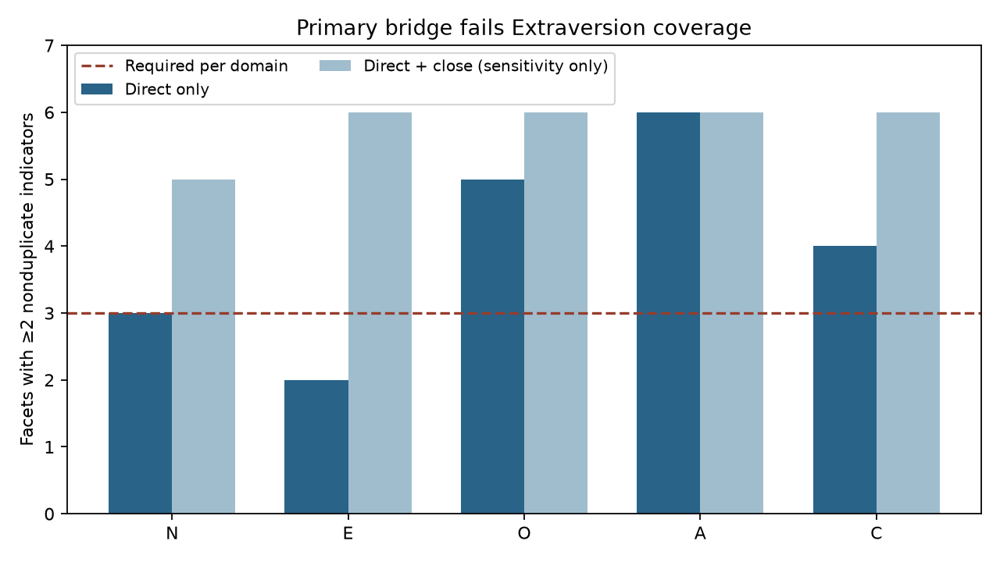
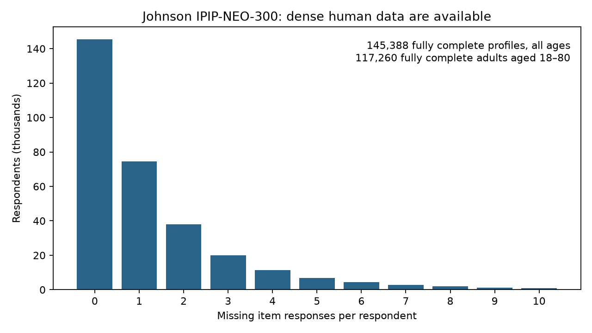

# AA-27 — dense human profile plausibility: presently untestable

**We cannot yet determine whether the model personas form personality configurations that humans actually exhibit.** The dense human reference is available and adequate, but the present model-trait bridge fails the frozen coverage requirement. This feasibility result separates a solvable measurement gap from evidence about unusual persona configurations: it does **not** show that the personas are psychologically implausible.

Johnson's first-party IPIP-NEO-300 data contain 307,313 respondents, including **117,260 adults with all 300 responses and all 30 facets complete**. The strict semantic bridge retains 20 facets, but only **two Extraversion facets** have at least two nonduplicate direct model-trait indicators. The frozen gate required 18 facets overall and at least three in every Big Five domain. Accordingly, no persona facet scores, human distances, outlier percentiles or supported/outlying classifications were calculated. The broader 29-facet construction is a sensitivity mapping and cannot replace the failed primary bridge.

## Source and scoring first

The [Johnson repository](https://osf.io/tbmh5/) supplies both response data and scoring documentation through its first-party API. All downloaded OSF file hashes agree with the archive metadata. The300-item response file is dense:0.403% missing item cells;145,388 complete respondents across all ages;117,260 complete adults 18–80. A 9/10-per-facet completeness allowance admits 237,832 adults. No broad profile imputation was performed. Detailed provenance, missingness, demographic composition, reuse conditions, source versions and hashes are in [dataset_audit.md](dataset_audit.md) and `source_manifest.json`.

The critical scoring detail is that **the released file already reverse-scores negative items**. The300-item official key has 148 negative keys. All 300 facet assignments and signs were cross-checked against the [official IPIP key](https://ipip.ori.org/newNEOFacetsKey.htm); the downloaded data must not be reversed a second time. Three small wording differences were normalized explicitly; no key signs were inferred. The source is a dense internet sample, not automatically a population reference.

## Frozen bridge result

| Domain | Direct-only facets | Direct+close facets | Required |
| --- | --- | --- | --- |
| Neuroticism | 3 | 5 | 3 |
| Extraversion | 2 | 6 | 3 |
| Openness | 5 | 6 | 3 |
| Agreeableness | 6 | 6 | 3 |
| Conscientiousness | 4 | 6 | 3 |

The full 7,200-row crosswalk covers every canonical model trait × every IPIP facet. It records canonical definition, polarity, tier, semantic rationale, source, same-pole alias group, confidence and inclusion in each construction. There are 182 explicitly adjudicated candidate pairs; other prior proposals remain excluded broad candidates and unmatched pairs are explicit none. This is one Astra semantic review, not inter-rater validation. All model-trait definitions and prior AA21/25 facet assignments come from pinned base91ad751 artifacts; no human correlations, HiFWB results, persona numeric values, or desired classifications selected mappings.

Direct means explicit correspondence to the official facet item content. Close mappings require an additional semantic inference. Broad-domain similarity is insufficient for a direct facet measure. The previous AA25 mapping was useful candidate evidence but was designed for broad domains, and its “direct” labels were not automatically inherited as facet-valid. Within each facet, same-pole near-aliases collapse deterministically to one representative. Opposite-pole traits are not automatically collapsed. Multiple retained direct mappings from the same trait to different facets are disclosed and would require interpretation of shared-indicator dependence; no covariance-based pruning was attempted.

Extraversion is the decisive shortfall:

| Facet | Nonduplicate direct indicators | Status |
|---|---|---|
| E1 Friendliness | avoidant− | One indicator; charismatic/flirty/nurturing are close only |
| E2 Gregariousness | gregarious+ | One indicator; extroverted/introverted definitions are close only |
| E3 Assertiveness | assertive+, dominant+, submissive− | Retained |
| E4 Activity Level | none | Animated/effusive describe expressive energy, not being busy/active; close only |
| E5 Excitement-Seeking | adventurous+ | One indicator; instrumental risk-taking need not mean seeking thrills |
| E6 Cheerfulness | entertaining+, optimistic+, serious− | Retained after humor-alias collapse |

A measured facet needs at least two nonduplicate traits. Adding close indicators produces six Extraversion facets, but doing so as the primary would relax the rule after coverage inspection. The other strict gaps are N2 anger, N4 self-consciousness, N5 immoderation, O2 artistic interests, C1 self-efficacy and C5 self-discipline. Exact counts, rejected aliases and one-sided flags are in `facet_bridge_coverage.csv`. Strict retained one-sided facets are listed there; they are not treated as fully bipolar measures.

## What was deliberately not run

The primary coverage failure stops Stages C/D. No facet values were constructed for Qwen, Llama or Gemma, no consensus profiles were calculated, and no five-domain agreement diagnostic was used to rescue the mapping. Exact 275-persona and 240-trait source schema/alignment and source hashes are verified separately using names/headers only; numeric cells are not evaluated. These alignment checks are provenance checks, not evidence of cross-model profile agreement.

No human reference/calibration/held-out split was made, no Mahalanobis or nearest-neighbor landscape was fitted, and no empirical percentile or persona classification exists. Cross-model agreement, family concentration, illustrative supported/outlying profiles, calibrated percentile bootstrap, five-domain plausibility comparison and leave-one-trait-out sensitivity are **not run**, not zero or negative results. Required downstream CSVs contain headers only and are paired with `execution_status.csv`. Requested calibration and facet-profile comparison figures are not fabricated; the two delivered figures show density and semantic coverage only.

The conditional analysis specification remains frozen in `analysis_freeze.md`: independent human reference/calibration/held-out sets, marginal rank normalization, human-calibrated regularized global and local distances, predeclared 95/99-percentile thresholds, consensus checks, and focused sensitivities. It is a future reproducible specification, not an executed analysis. The freeze documents incidental exposure to published workbook example norms during sheet inspection; those norms were not the acquired cohort's distributions and were not used in any semantic decision or calculation.

## Interpretation and next step

**Presently untestable with this direct semantic bridge.** Human data availability is no longer the barrier. A later authorized study would need independently defensible direct indicators for at least one additional Extraversion facet, without duplicating existing aliases, plus validation of the retained facet constructions and one-sided/shared indicators. This audit does not authorize new trait extraction, prompts or model inference. It also does not prove that the existing trait collection lacks every possible adequate crosswalk: the result is conditional on the explicit conservative semantic judgments, which remain reviewable.

If independently reviewed mappings change, freeze a new version before looking at profile comparisons; never change them to obtain plausible personas. Even a future passing analysis could support only relative trait combinations within a sample-conditional facet space, not absolute score equivalence, population prevalence, simulated human behavior, causal/longitudinal validity, subjective wellbeing or validity of all 240 traits. No HiFWB scoring or intervention analysis occurred.

## Verification, artifacts and provenance

Model used: **GPT-6 Astra; High thinking**, as requested. Infrastructure policy commit **6d564c3** preceded substantive work. Scoring/crosswalk/coverage freeze commit **79417c2** preceded human response auditing and model-source schema checks. Branch: **codex/aa27-ipip-neo-profile-plausibility**, base **91ad7519fe89b55921f58680a9a734e158320ca4**. The completion commit is the commit containing this report; `git log -1 -- aa27_report.md` resolves it.

`verify_aa27.py` checks source/freeze hashes, all 300 official key assignments/signs, two independent eligibility parsers, missingness reconciliation, all 7,200 judgments, nonduplicate selection, the failed gate, exact source alignment, preserved AA16–26 artifacts, and the absence of respondent-level outputs. Deterministic reruns compare aggregate-output hashes. Split separation, metric calibration and persona bootstrap checks are marked not applicable because the gate correctly prevented those operations. `verification_report.json`, `deterministic_rerun_verification.json`, `closeout_verification.json` and `artifact_inventory.csv` distinguish these checks from unexecuted validation.

Generating scripts: `acquire_sources.py`, `extract_scoring_spec.py`, `build_crosswalk.py`, `audit_dataset.py`, `build_feasibility_report.py`, `verify_aa27.py`. Scoring-workbook extraction uses the bundled Python/openpyxl in read-only mode; no spreadsheet is authored or recalculated. Aggregate numerical audit/figures use the existing local scientific environment. No new installation or paid compute was needed. Raw sources are gitignored and only aggregate human counts are saved. AA16–26 artifacts remain untouched. Canonical findings, claims, provenance, state, thread-start, startup manifest, research index, navigation/file/raw-URL indexes, and runtime current results are updated.
