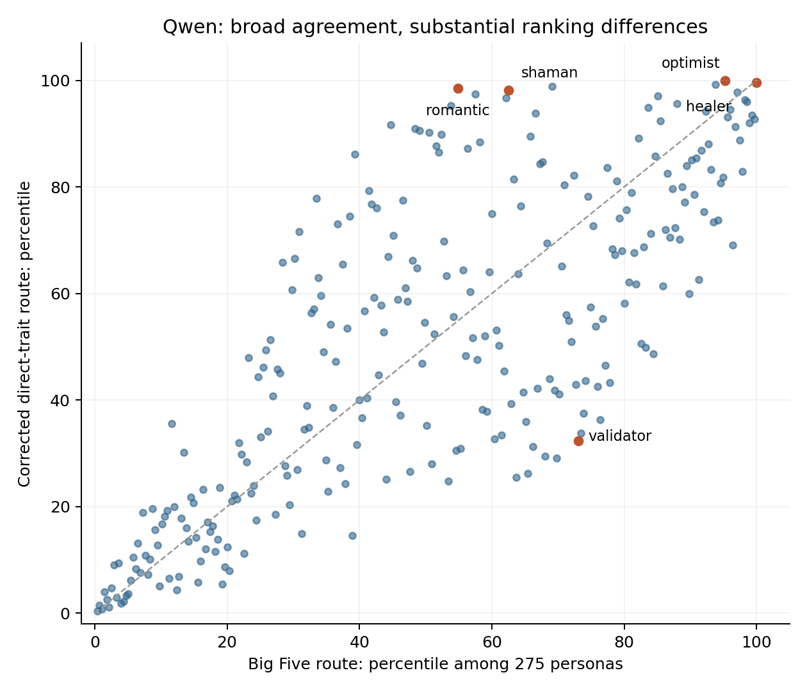

# Well-being mapping comparison

2026-09-21. Corrected AA22 direct-trait transport versus frozen AA21 primary expanded Big Five route.

## Finding

The two mappings broadly agree, but are not interchangeable. Qwen has the largest ranking disagreement: Spearman correlation 0.776, median absolute change 31 ranks among 275 personas, and only two shared top-ten personas. The corresponding local full-activation-space ascent directions remain acute for every persona in all three models. For Qwen their median separation is 27.1 degrees. This supports comparing both objectives in subsequent geometric exploration; it does not select one as the true well-being direction.

## Ranking comparison

| model | pearson_r | spearman_rho | top10_overlap | bottom10_overlap | median_absolute_rank_change |
| --- | --- | --- | --- | --- | --- |
| qwen | 0.861 | 0.776 | 2 | 6 | 31.0 |
| llama | 0.951 | 0.927 | 5 | 8 | 17.0 |
| gemma | 0.943 | 0.931 | 6 | 5 | 18.0 |

Pearson compares continuous scores; Spearman compares ordering. Top/bottom overlap is out of ten. Percentiles are relative to the 275 personas within each model. The scores have different scales, so their raw magnitudes are not compared.

### Selected Qwen differences

| persona | bigfive_rank | direct_rank |
| --- | --- | --- |
| healer | 1 | 2 |
| optimist | 14 | 1 |
| romantic | 125 | 5 |
| shaman | 104 | 6 |
| validator | 75 | 187 |

## Directions in activation space

| model | readout_vector_angle_degrees | local_gradient_angle_min | local_gradient_angle_median | local_gradient_angle_max |
| --- | --- | --- | --- | --- |
| qwen | 28.262 | 25.284 | 27.111 | 29.099 |
| llama | 29.109 | 27.282 | 31.674 | 33.072 |
| gemma | 28.916 | 31.434 | 32.145 | 32.441 |

Both frozen scoring functions have the form s(h)=b·h/||h||+c, with different readout vectors b. The direct vector combines the 41 unit trait vectors with corrected human association weights divided by each model trait-score standard deviation and the absolute-weight sum. The Big Five vector combines the saved unit domain directions with AA21 coefficients and fixed persona standard deviations. Emotional stability reverses neuroticism. All means and standard deviations stay frozen at the original 275 personas.

For a persona with u=h/||h||, the local gradient is [b−u(u·b)]/||h||. The gradient-angle comparison can be computed from the two readout vectors and their uncentered persona projections without reconstructing the full persona tensor. The common persona norm cancels in the angle. This is an analytic infinitesimal full-space comparison, not an executed model intervention, a finite-radius solution, or a constraint to the first three/five PCs.

The 240 unit trait vectors were reconstructed using the complete saved 239-component trait PCA, its mean, and all trait scores. As an independent reconstruction check, rebuilding the Big Five directions agrees with saved direction coordinates to less than 5.1e-8. Finite precision remains at the saved float32 artifact level.

## Three- and five-dimensional map diagnostics

| model | dimensions | metric | fitted_gradient_angle_degrees | bigfive_fivefold_r2 | direct_fivefold_r2 |
| --- | --- | --- | --- | --- | --- |
| qwen | 3 | raw_PC_units | 24.687 | 0.91 | 0.882 |
| qwen | 3 | standardized_PC_units | 31.501 | 0.91 | 0.882 |
| qwen | 5 | raw_PC_units | 25.164 | 0.908 | 0.887 |
| qwen | 5 | standardized_PC_units | 31.685 | 0.908 | 0.887 |
| llama | 3 | raw_PC_units | 14.917 | 0.832 | 0.823 |
| llama | 3 | standardized_PC_units | 14.702 | 0.832 | 0.823 |
| llama | 5 | raw_PC_units | 19.516 | 0.863 | 0.918 |
| llama | 5 | standardized_PC_units | 16.829 | 0.863 | 0.918 |
| gemma | 3 | raw_PC_units | 14.629 | 0.79 | 0.825 |
| gemma | 3 | standardized_PC_units | 17.521 | 0.79 | 0.825 |
| gemma | 5 | raw_PC_units | 16.974 | 0.898 | 0.899 |
| gemma | 5 | standardized_PC_units | 17.971 | 0.898 | 0.899 |

These are descriptive linear score surfaces fitted to the saved persona PC coordinates, not exact projected activation gradients. Fivefold R² tests how well a plane predicts withheld existing persona scores. It does not validate human well-being or unseen perturbations. Raw-PC units use ordinary Euclidean activation distance; standardized-PC units give one population standard deviation on each PC equal length and therefore change the radius metric. Both are shown rather than silently choosing one.

For Qwen the raw-coordinate fitted directions differ by 24.7 degrees in three PCs and 25.2 degrees in five PCs; standardizing the axes increases this to about 31.5–31.7 degrees. These global linear surfaces have the same fitted ascent direction at every starting point. Persona-dependent finite-radius recommendations require the exact score function, a specified distance metric and feasible region, and the original persona PCA basis/normalization information. We have not treated a smoothed viewer surface as that function.

## Human evidence and interpretation

The corrected AA22 same-sample comparison (301 held-out respondents) gives R² 0.5299 for Big Five, 0.5061 for the direct index alone, and 0.5954 for both. The increment over Big Five is 0.0654, paired fixed-test interval [0.0330, 0.0976]. This supports complementary information, not superiority of the direct score by itself. This common-sample Big Five performance is distinct from the broader-sample AA21 fit used by the viewer.

The direct method has no Big Five bottleneck, but the 41 weights are marginal trait–outcome correlations, not jointly estimated independent trait effects. Correlated traits can therefore receive overlapping weight. Both routes depend on a semantic human-to-model bridge; neither establishes that increasing a persona score improves a person’s well-being. Historical whole-cohort item preprocessing in the corrected human refit remains an acknowledged limitation. No new human fit or causal claim is made here.

## Verification and scope

All 825 persona rows were rescored. The old AA22 recipe reproduces its historical outputs to below 1.3e-15, and centered AA21 scores reproduce to below 5e-16. Corrected full-sample weights differ from old weights by up to 0.1445; all new direct scores use the corrected weights. This restores only AA22 transport for this comparison, not AA23/24 or other stale downstream analyses. The existing public viewer remains unchanged.

Inputs are pinned to repository commit 6de44e52d064c929f43740f2237e8e5be9748bca and hashed in source_manifest.json. run_comparison.py reproduces scores, directions, and diagnostics; build_report.py renders this report and chart. No target-model inference, GPU, paid compute, or respondent-level data was used. Actual assistant model identity/effort is unavailable and recorded as unknown.

## Next analysis

A radius analysis should report both objectives and their common improving directions. Start with Qwen, use fixed standardization and an explicitly chosen distance metric, and distinguish infinitesimal agreement from finite steps. Exact three/five-PC perturbations and trait changes should be evaluated through the activation readouts, with the original PCA basis and persona residuals preserved. This comparison does not authorize a live model intervention or change the public ranking.
